  

<table align="center" border="0" cellpadding="20" cellspacing="0" width="100%">
<tr>

<!-- LEFT SIDE -->
<td width="35%" align="center" valign="middle">

  

  

  

  

</td>

<!-- RIGHT SIDE -->
<td width="65%" valign="top">

# 👋 Hi, I'm Nandani Kumari

### 🚀 Frontend Developer • Ethical Hacker • VAPT Engineer

💻 Passionate about building secure, scalable and modern web applications while exploring offensive and defensive cybersecurity.

---

### 💡 Focus

- 🛡 Web Application Security
- 🌐 API Security
- 🔐 Vulnerability Assessment & Penetration Testing (VAPT)
- 🐞 Bug Bounty Hunting
- ⚡ Secure Coding
- 🖥 Linux & Network Security

---

> 💜 **"Build Secure • Hack Smart • Never Stop Learning."**

</td>

</tr>
</table>

---

# 🛠 Tech Stack

  

</td>

# 📊 GitHub Analytics

---

# 📈 Contribution Graph

---

# 🐍 Contribution Snake

  

# 💻 Frontend Development

  

---

# 🛡️ Cyber Security

  
  
  
  
  
  
  
  

---

# ⚔️ Security Tools

  
  
  
  
  
  
  
  
  
  
  
  
  

# 💻 Terminal

  

# 📬 Connect

---

# ☕ Support

---

---

                                     ⭐ **Code Secure • Build Better • Keep Learning**
